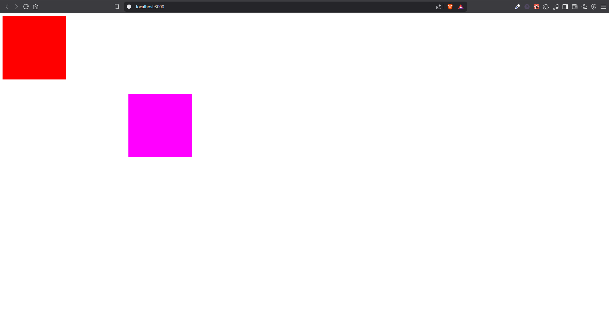

# Atrybuty elementów
- [Zadania](#zadania)

Wykorzystujemy pisownię camelCase

**Przykładowe atrybuty**
- class => className
- minlength => minLength
- for => htmlFor
```tsx
<div className='section-primary'></div>
<div className='section-primary'/> 
// Jeśli nie ma zagnieżdzeń w środku diva, można go zwyczajnie domknąć
<label htmlFor="login">Login</label>
<input type="text" id='login' minLength={8}/>
```

---

**Atrybut style**
Wykorzystwywany gdy dynamicznie stylować elementy
```tsx
<div style={
    {
        backgroundColor: 'red',
        color: 'green',
        margin: '10px'
    }
}/>
```
Podwójne `{}` ponieważ pierwsze nawiasy mówią że przypisujemy wyrażenie jako wartość atrybutu, natomiast drugie precyzują obiekt

<br>

Randomowe umieszczenie bloku
```tsx
const top = Math.round(Math.random()*500) // losuje od zera do 500
const left = Math.round(Math.random()*500)

createRoot(document.getElementById('root')!).render(
  <>
    <div className='section-primary'></div>
    <div className='section-primary' id='second-box' style={{
      position: 'absolute',
      top,
      left,
      backgroundColor: 'magenta'
    }}/>
  </>
)
```


Można też wyciągnąć `style` jako zewnętrzny obiekt i podstawić do elementu
```tsx
const styleDiv: CSSProperties = {
      position: 'absolute',
      top: 50,
      left: 50,
      backgroundColor: 'magenta'
}

createRoot(document.getElementById('root')!).render(
  <>
    <div className='section-primary'></div>
    <div className='section-primary' id='second-box' style={styleDiv}/>
  </>
)
```
Przypisanie obiektu style do dwóch bloków ale z innymi odstępami `top`, `left`

```tsx
const top = Math.round(Math.random()*500)
const left = Math.round(Math.random()*500)
const topSecond = Math.round(Math.random()*500)
const leftSecond = Math.round(Math.random()*500)

const styleDiv: CSSProperties = {
      position: 'absolute',
      backgroundColor: 'magenta'
}

createRoot(document.getElementById('root')!).render(
  <>
    <div className='section-primary' style={{
      ...styleDiv, // zaczerpie styl z obiektu styleDiv
      top, // identyczna nazwa stałej co właściwości
      left
    }}/>
    <div className='section-primary' id='second-box' style={{
      ...styleDiv, // zaczerpie styl z obiektu styleDiv
      top: topSecond, // inna nazwa stałej niż nazwa właściwości
      left: leftSecond // inna nazwa stałej niż nazwa właściwości
    }}/>
  </>
)
```
Poprzednie właściwości `top` i `left` domyślnie korzystały z `px`, więc gdy chcemy skorzystać z `%` użyjemy:

```tsx
const topSecond = Math.round(Math.random()*100)
const leftSecond = Math.round(Math.random()*100)

const styleDiv: CSSProperties = {
      position: 'absolute',
      backgroundColor: 'magenta'
}

createRoot(document.getElementById('root')!).render(
  <>
    <div className='section-primary' id='second-box' style={{
      ...styleDiv,
      top: `${topSecond}vh`,
      left: `${leftSecond}vw`
    }}/>
  </>
)
```
### Zadania:
*Zad.1*
Stwórz funkcję zwracającą losowy kolor z następujących: red, blue, green, yellow, purple.
Przypisz wynik działania tej funkcji jako kolor tła diva o wymiarach 100px na 100px.
```tsx
const randColor = () => {
  const colors = ['red' , 'blue', 'green', 'yellow', 'purple']
  const index = Math.round(Math.random()*(colors.length - 1))

  return colors[index]
}

createRoot(document.getElementById('root')!).render(
  <>
    <div style={{
      width: 100,
      height: 100,
      backgroundColor: randColor()
    }}></div>
  </>
)
```
*Zad.2*
Wykorzystując funkcję prompt, poproś o podanie koloru w postaci szesnastkowej (np. #aa1bf3) i ustaw ten kolor jako tło diva o wymiarach 100px na 100px. Zanim przypiszesz kolor, zweryfikuj czy podana wartość posiada dokładnie 7 znaków – jeżeli nie, ustaw kolor tła na czarny i wyświetl czerwonym kolorem napis „Błędny kolor” wewnątrz diva.
```tsx
let userColor = prompt("Podaj kolor w postaci np: #ff43a1: ")
let content = null
if(userColor?.length !== 7)
{
  userColor = "black"
  content = "Błędny kolor!"
}

createRoot(document.getElementById('root')!).render(
  <>
    <div style={{
      width: 100,
      height: 100,
      color: 'white',
      backgroundColor: userColor
    }}>{content}</div>
  </>
)
```

---